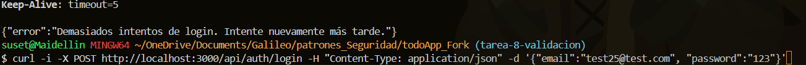
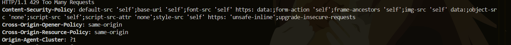
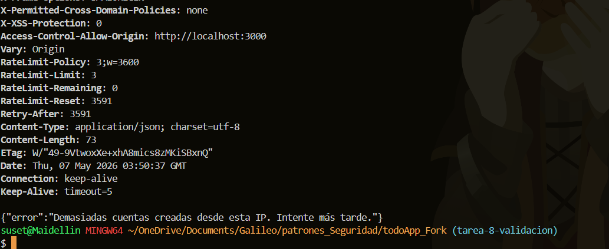
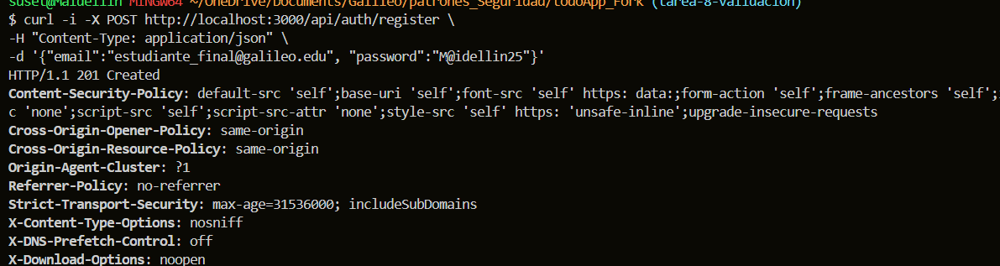

1 prueba rate limit:
En esta prueba se valida el funcionamiento del middleware de Rate Limiting en el endpoint de login. Se configuró una política que permite un máximo de 5 intentos por dirección IP. Al detectar el sexto intento consecutivo, el servidor bloquea la petición y devuelve un estado HTTP 429 (Too Many Requests) junto con el header Retry-After, mitigando de esta forma posibles ataques de fuerza bruta.

2 prueba ip limit 
Aquí se comprueba la protección del endpoint de registro contra la creación masiva y automatizada de cuentas. La regla restringe la creación a un máximo de 3 cuentas por hora desde una misma IP. Al cuarto intento, el servidor interviene y rechaza la solicitud con un código HTTP 429, protegiendo la base de datos de saturación.

3. creacion de usuario 
Esta ejecución demuestra que las políticas de seguridad implementadas no afectan a los usuarios legítimos. Al realizar una petición de inicio de sesión respetando los límites establecidos y con credenciales válidas, el sistema procesa la solicitud con normalidad, devolviendo un código HTTP 200 OK y emitiendo correctamente los tokens de acceso.
