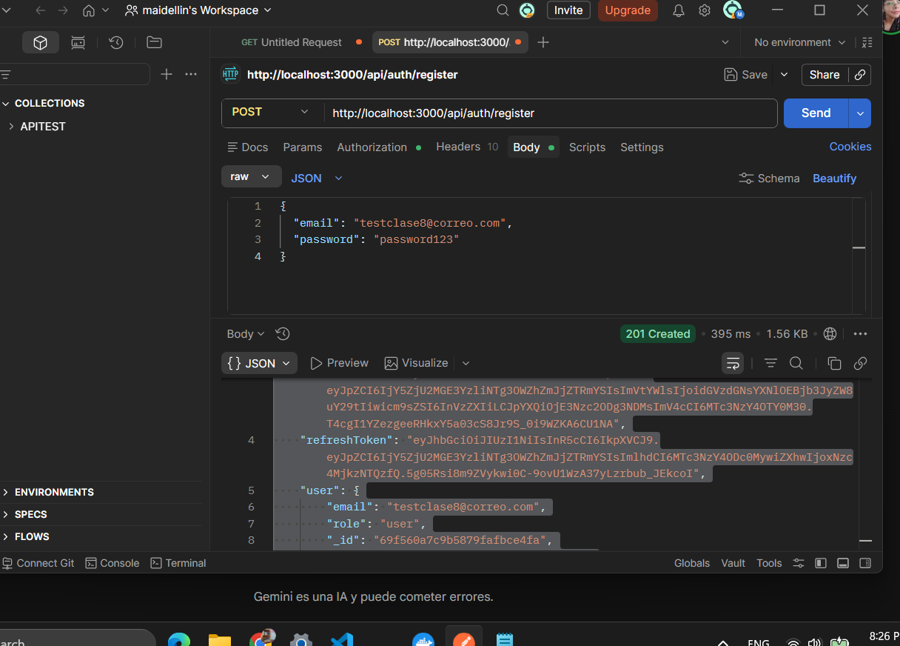
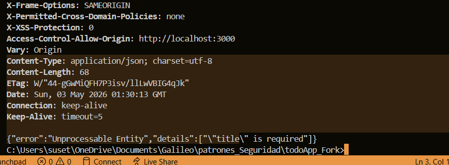
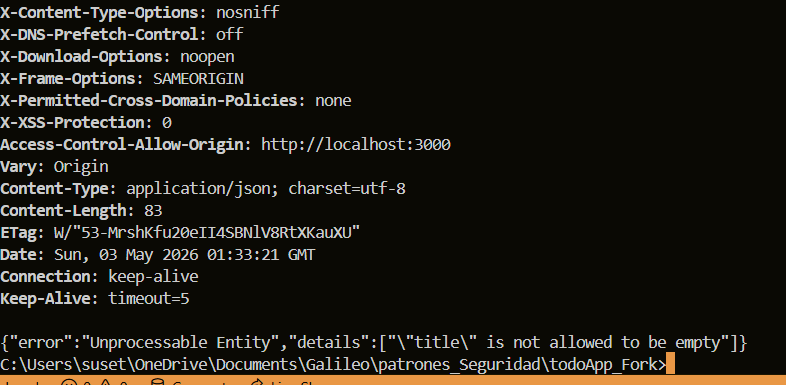
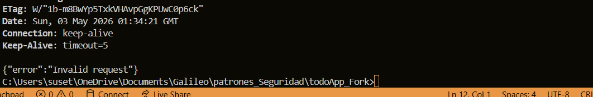
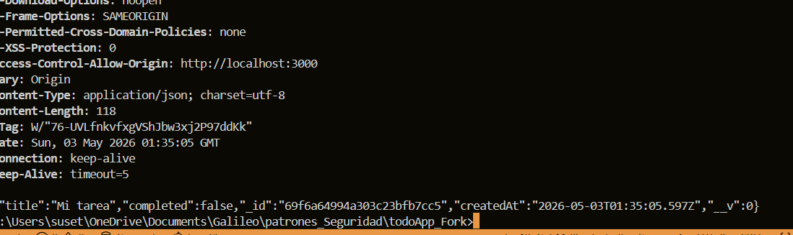

creamos un nuevo usuario para obtener el token 

Comprobar que el validador configurado con Joi exige los campos que se definieron como obligatorios. Al enviar una carga útil que no tiene el campo title, el middleware intercepta la petición y la rechaza con el estado 422 Unprocessable Entity para evitar guardar registros incompletos.

El titulo no puede estar vacio

 Al consultar un ID que tiene un formato que la base de datos no reconoce, el sistema atrapa el error interno y devuelve un mensaje seguro y genérico con el estado 400, asegurándose de ocultar el stack trace para no exponer la estructura interna del código

 Demuestra que el middleware de validación deja pasar la petición y el servidor logra guardar la nueva tarea con éxito, devolviendo el código

